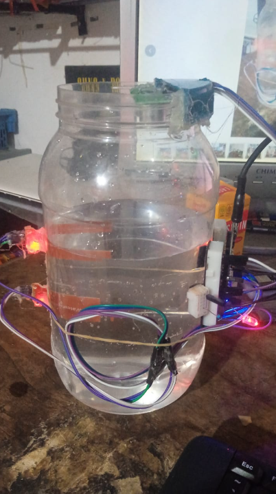
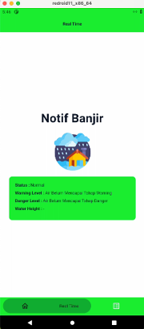

# Flood Notification App (Node js)

#### this is the script for esp8266 connected to 2 water level sensor and a ultrasonic sensor.
#### If the water reach the first water level sensor then "warning",
#### If reach second water level then danger and the water is measure by ultrasonic
#### the value is send to node js server (run it using "bun --hot index.js")
#### then it will be display to a flutter app.

